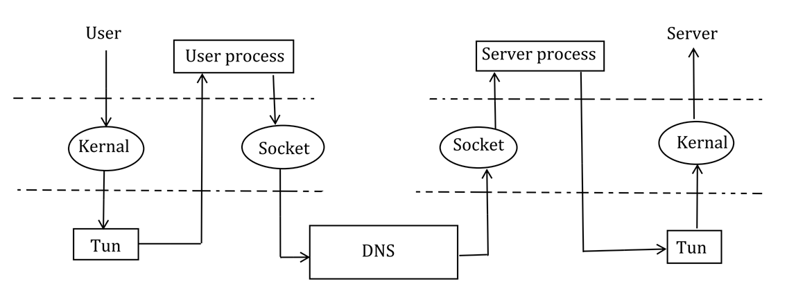
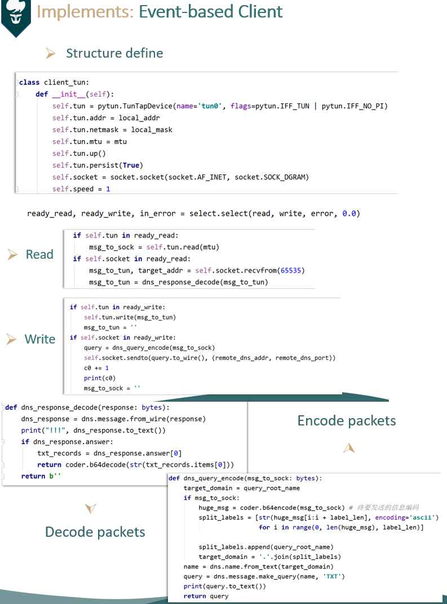
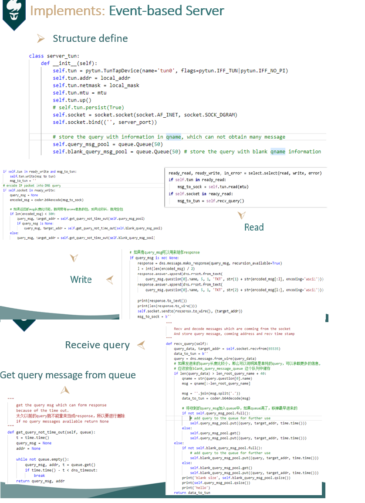
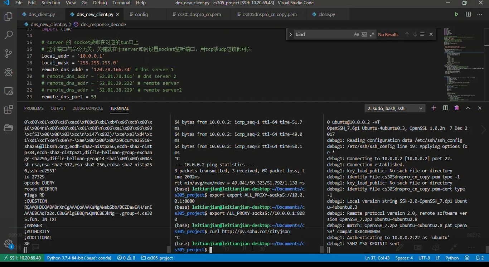

# IP Over DNS Project Report

## Background

这里原理部分用中文表述方便很多，我们决定用中文解释

### Tun interface, Tun tunnel

​	Tun设备的原理就是通过软件模拟一张三层的网卡，而这张网卡的作用就是他能将传入的包读入文件，然后应用程序就可以通过这个文件读取相应包的内容，将数据处理之后发出去。Tun tunnel就是基于这一点，在用户处理的时候对数据包做手脚，用我们这个项目的例子，DNS 数据包一般来说是容易通过各种防火墙的，所以可以基于DNS搭建穿越防火墙的隧道，但是数据包本身不是DNS包，这个时候我们就可以借助Tun Interface的特性，将发给Tun device的IP数据报文交给用户程序，经过DNS处理后在通过网卡送出，这个时候就完成了一个DNS隧道

### DNS

​	DNS是域名解析服务的缩写，它做的事情就是通过域名解析相应的ip地址，使得应用程序能够正确访问服务程序。而正是因为使用的广泛而基本，DNS包不会被大多数防火墙拦截，这也就给了DNS包无以伦比的穿透特性。而我们这个项目做的就是利用DNS server，将本机与服务器建立代理，使得本机也能访问服务器能访问的资源

### Proxy/NAT

​	 Proxy做的事是代理网络用户去取得网络信息。形象的说：它是网络信息的中转站。在两端通过DNS协议建立连接之后，我们要使服务器成为我们的网络信息的中转站， 使得本机也能访问服务器能访问的资源。在这个项目中，我们使用的是Socks5代理协议

​	NAT 分为两种SNAT/DNAT，SNAT指的是中间路由器或服务器根据将内网中的ip头替换成自己的公网ip头，发向目的ip，就相当于在中间建立了映射关系，让网络内部的机器能通过这台路由器或服务器访问相应的网络资源。DNAT反之，做的事是让网络外部的机器能访问网络内部的机器，就相当于做了一个端口映射。

## Implementation

### The network topology



### Solutions

#### Design of solution

​	To solve this problem, there are two device to handle, simple python program cannot deal with that. After searching in github, we find a simple code demo of Tun usage in python[1]. So we decide to use event-based programing skill to solve this problem.

#### configure the routes

​	The Tun device can be set by python in following code

```python
self.tun = pytun.TunTapDevice(name='tun0', flags=pytun.IFF_TUN|pytun.IFF_NO_PI)
self.tun.addr = local_addr
self.tun.netmask = local_mask
self.tun.mtu = mtu
self.tun.up()
```

​	The routing of the server can be set by ssh(Socks5) or SNAT. For SNAT, we can set server by

```bash
# start forwarding
sudo echo "1" > /proc/sys/net/ipv4/ip_forward
# SNAT rule
sudo iptables -t nat -A POSTROUTING -s 10.0.0.1 -j SNAT --to-source 172.31.28.88
# -s means SNAT source ip, which should be client TUN address in this case
# --to-source means the SNAT modify the header to which ip address,
# 	which should be local NIC ip address.
```

​	Then we can set client by changing the firewall configuration 

```bash
# make all client packets were sent though tun device
route add default gw 10.0.0.2
# But my client was a remote host, so I use
sudo ip route add 14.215.177.0/24 dev tun0
# which just add www.baidu.com server address to forward to tun0 device
# Then I use ping to test the connection between client and www.baidu.com
# which can work!!!
```

​	If we use Socks5 on DNS tunneling which is more easy than former solution

```bash
ssh -i cs305dnspro_cn.pem -D 10.0.0.1:22 ubuntu@10.0.0.2 -p 53
# we only need to execute this command on client side
# Then there are an Socks5 Proxy link estblish on port 22
```

#### Encode and Decode Data

​	The data in both side will encode and decode in base64 encoding. Client side will store the sending data in the qname of query record. Server side will store the data into two TXT type answer field, which should be resembled in client.

#### Protocol between client and server 

​	This was used to solve the problem of asymmetric caused by DNS protocol. Server want to send data actively instead of passive in DNS protocol. So we have to add a loop to send blank query message periodically. And the blank query message can be used to send data back from server side. However, the blank query message have timeout. We clean the expired query message before we want a empty message. At the same time, there are **two queue** to store the  query message from client, which is because the query message can carry data. These message have a limited at data length, which is going to be sent back. In a word, if the data in server side, which is going to be sent to Tun device, has a small size, the server program will choose query message with data to form a response. And if the data in server side, which is going to be sent to Tun device, has a big size, the server program will choose blank query message to form a response.

#### Extra features

1. Split data into two piece in server side and send two record instead of one, which can load more data into it.
2. When storing blank query message sent by client in server, the program will store the packet with timestamps, because DNS query have timeout. 

### Important code explanations

For this part, I take some picture from presentation powerpoint.

#### Client



#### Server



The code is well committed, which is easy to see the implementation.

Here are two little **performance optimization** in the program

1. Split data into two piece in server side and send two record instead of one, which can load more data into it.
2. When storing blank query message sent by client in server, the program will store the packet with timestamps, because DNS query have timeout. 

## Testing

​	We test the program by ping in each side and ssh tunneling, we also test the program with iptables set. However, my local computer is a remote host, I just set some specific routing rule to test whether it can ping through DNS tunneling.



Here I only put my test of SSH. Ping by each side was tested in presentation.

## Contribution

11711707 雷天健：Finding material about Tun device and DNS tunneling. Server side coding and integration testing of the code

11712639 王冬青：Finding material about Tun device and DNS tunneling. Client side coding,  made the presentation PowerPoint and wrote README file.

11712641 邹萱萱：Finding material about Tun device and DNS tunneling. Client side coding and report writing.

In a word, every member had contributed a lot in this project. So, the result should be the same

## Conclusion

（这里的话有点长，所以我们也用了中文表达）

​	在写本次项目的时候，我们其实碰到了挺多的坑，当然这一些坑也给我们带来了不少的收获。

​	在我们刚开始读文档理解项目的时候，其实就碰到了很大的困难，不是说文档写的晦涩难懂，只是这篇不仅是英文文档，而且长达2000多个词，而且里面涉及到的重点原理与概念基本上没接触过，导致理解起来很吃力。然后，看到中间提到的，DNS包没有那么大，可能要分包的时候，心态就有点失调了(rdt‘s ptsd)。所以，据我所知，许多组就是在看文档这一步就放弃了的（当然他们的选择很果断也很理智），但是在理解通透之后发现其实这个任务本质上不是很困难的（不分包的情况下）

​	写的时候问题就更多了，因为文档和原理没有完全理解透彻（当时自认为理解的很不错），写代码的时候走错了不少的路，在读完文档之后，我们看到要分包，我们马上就想到，能不能用TCP连接发送DNS报文，这样理论上是不是能解决需要分包的问题。于是我们也没有深入理解DNS over TCP的限制，就去做了很多尝试，尝试着client通过TCP连接到DNS server，使得DNS server也通过TCP forward DNS报文到我们的服务器上，试了小一天（dnspython 文档写的不够详细而且没有类型检查，疯狂报错）。试了半天，发现不管如何，DNS server forward到server的总是UDP包，而且发的太大了还不forward。最后看了一眼DNS over TCP的RFC文档，原来DNS over TCP包的长度是有限制的，而且不比UDP的要好，算是白给了。

​	折腾完TCP，我们又想到，用EDNS会不会使得整个代码更好写一点，而且也可以让DNS报文携带的一次携带的东西更多，或许就可以避开分包。然后了解了一天EDNS怎么用，报文格式是什么，在dnspython中应该则么样使用EDNS（又因为文档问题踩了一地坑），然后一测试，发现见鬼了，DNS server就是不把EDNS那一段给forward出去，仅仅只是forward问题字段，于是有白给了一整天

​	 然后又想了半天，为什么文档里说调整MTU可以不用分包呢？终于才想到，原理中Tun是一个三层设备。同时，Tun是信息的提供者，我们只是写一个程序把Tun提供的的包发送出去，于是我们才明白，分包什么的，没有什么意思，直接调小一点，就OK了。于是我们才进入正确的轨道。

​	虽然说原理理解了，但是实现的时候坑还是有点多，因为一些网络状况的原因，很多我们认为是bug的现象其实是网络延迟带来的正常现象。然后实现两端通过DNS ping通也不是那么好实现，毕竟DNS query & response 是一个非对称的过程（不过每次我们弄清楚了实现方法之后学助也会很及时的发送相应的实现方法，好评）。当然助教的帮助起了很大的作用，帮我们理解了很多我们难以理解的现象，使我们没有浪费太多时间在那些我们认为的Bug上。

## References && Acknowledgements

1. A really good reference for us to know how to use python to write a event based simple ping program of TUN: https://github.com/montag451/pytun/blob/master/test/test_tun.py

2. A material Provides basic insight of TUN device: https://github.com/ICKelin/article/issues/9

3. RFC is a nice teacher when facing a Computer network project: RFC 7766, RFC 1035, RFC 1464
4. A very good material about iptables setting in linux host:  http://xstarcd.github.io/wiki/Linux/iptables_forward_internetshare.html 
5. Sun teacher assistant helped us a lot, which provides many advice to finish this project